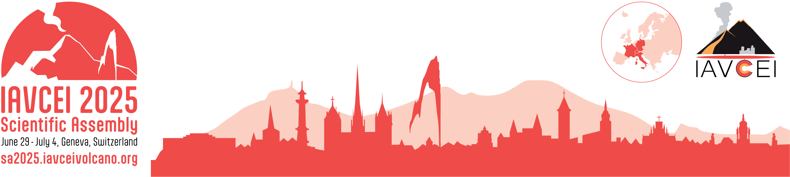
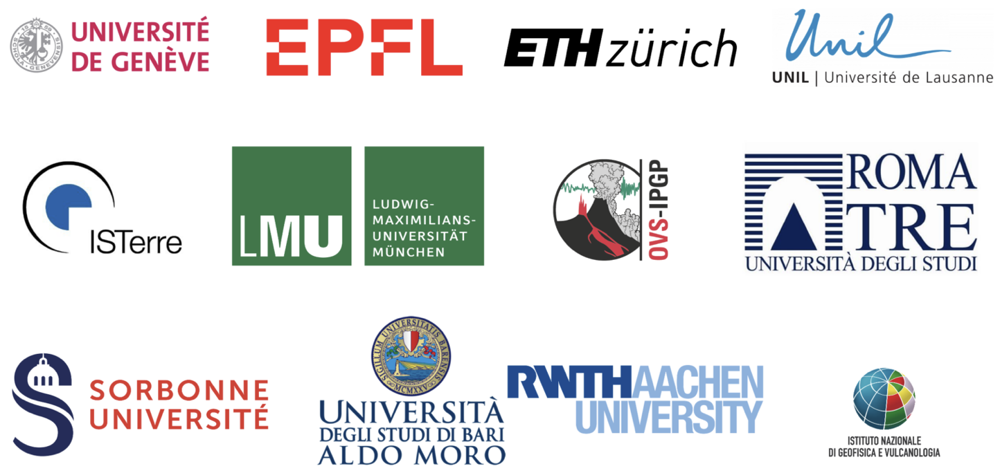

{ width='100%'}

# **IAVCEI 2025 Scientific Assembly** 

## The energies of magma: From volcanic eruptions and mineral resources to geothermal production and sustainability

---

Welcome to the scientific program of the 2025 IAVCEI Scientific Assembly. This website hopefully contains all the information for you to get the most of the conference.

---

### [Scientific program](program.md) 

- [Scientific sessions](sessions_comparison.md)
- [Keynote talks](keynotes.md)
- [Workshops](workshops.md)
- [Commissions meetings](commissions.md)

### [Social program](social/index.md)

- [Movie night](social/movie-night.md)
- [SciCom demonstrations](social/demonstrations.md)

### [Maps](maps.md)

- [Maps of the different conference venues](maps_geneva.md)
- [Maps of the main conference venue](maps_venue.md)
- [Maps of the poster boards](map_poster_boards.md)

--- 

{ width='100%'}