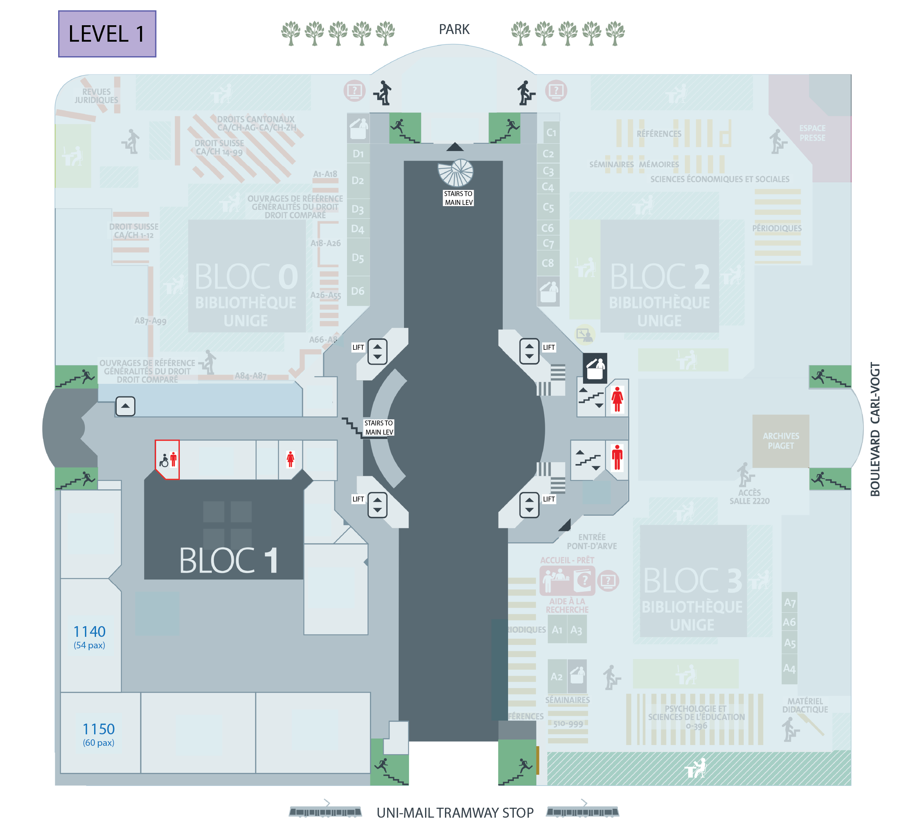

# UniMail

!!! info "Additional rooms"

    - A **speaker ready room** is available on **Level 1, Room 1193**. 
    - A **nursing quiet room** is available on **Level 5, Room 5193**.

## Scientific sessions

The scientific sessions take place in 5 different rooms:

- **Ground floor:** Rooms `R280`, `R290` and `R380`
- **Level -1**: Rooms `S150` and `S160`

=== "Main level"

    

=== "Level -1"

    

[:fontawesome-solid-file-pdf: Download the map](img/maps/IAVCEI25_UNIMAIL_CONFERENCE_final.pdf){ .md-button .md-button--primary }

## Workshops on Saturday 28th of June 

=== "Ground level"

    

=== "Level 1"

    

=== "Level -1"

    

[:fontawesome-solid-file-pdf: Download the map](img/maps/IAVCEI25_MAP_WORKSHOPS_SAT28THJUNE_final.pdf){ .md-button .md-button--primary }

## Other workshops and social events

=== "Ground level"

    

=== "Level 1"

    

=== "Level -1"

    

[:fontawesome-solid-file-pdf: Download the map](img/maps/IAVCEI25_MAP_ALL_WORKSHOPS_SOCIAL_final.pdf){ .md-button .md-button--primary }

{  style="transform: translateY(35px);" }
