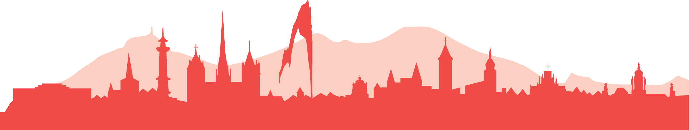

# The Earth's fire: a human adventure

Come and visit the exhibition **"The Earth's Fire, a human adventure"!**

Organized by the Department of Earth Sciences (UNIGE)

> - :fontawesome-solid-map: [66 Boulevard Carl Vogt, 1205 Geneva](https://maps.app.goo.gl/T5vFA68Hxou2CYZ96) (2 blocks from the Conference building)
> 
> - :fontawesome-solid-clock: Every day from 7:30 am to 7 pm (Sunday from 2:30 pm to 5 pm)

{width='100%'}

{  style="transform: translateY(35px);" }