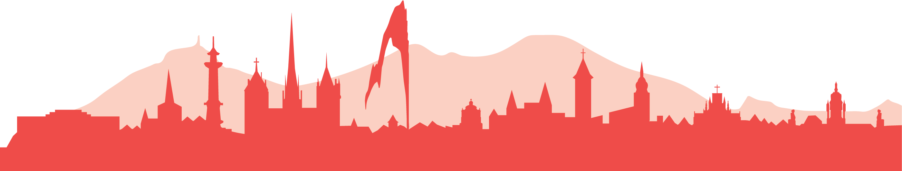

# Using Satellite Data for Volcano Monitoring

> :fontawesome-solid-users: Juliet Biggs (COMET-Bristol); Carlos Andres Laverde (Servicio Geologico Colombiano); Marco Bagnardi (USGS-CVO); Grace Bato (JPL); Simon Carn (MTU); Loreto Cordova (OVDAS-Chile); Hannah Dietterich (USGS-AVO); Edna Dualeh (COMET-Bristol); Susanna Ebmeier (COMET-Leeds); Ben Esse (COMET-Manchester); Tarsilo Girona (USGS-AVO); Ian Hamling (GNS New Zealand); Gabor Kereszturi (Massey University); Paul Lundgren (JPL); Virginie Pinel (IRD-ISTerre); Michael Poland (USGS-CVO); Matthew Pritchard (Cornell); Isabelle Taylor (COMET- Oxford)
> 
> :fontawesome-solid-calendar-days: Saturday 28th – Sunday 29th June
> 
> :fontawesome-solid-clock: 09:30-16:30
> 
> :fontawesome-solid-map: [Room M1140](maps_venue.md#__tabbed_2_2)

--- 

Remote Sensing provides a fast and versatile baseline information to monitor volcanic activity from a safe distance. Volcano monitoring has been changing rapidly and remote sensing imagery have been used to assess on-going volcanic activity, develop databases, and to forecast volcanic hazards. These data streams often include thermal, shortwave infrared, ultraviolet, and visible and radar imagery from ground, airborne and satellite platforms. 

This workshop aims to introduce new tools and technology available for volcanic observatories to assess and quantify past and on-going volcanic activity. The workshop will provide a better understanding of the currently available technologies and methods, remote sensing data sources for volcano monitoring, as well as to facilitate a communication between the science community and operational volcano observatories. By the end of the workshop, participants will develop a working understanding of different remote sensing data and basic analytics required to adopt new tools for volcano monitoring.

{  style="transform: translateY(35px);" }